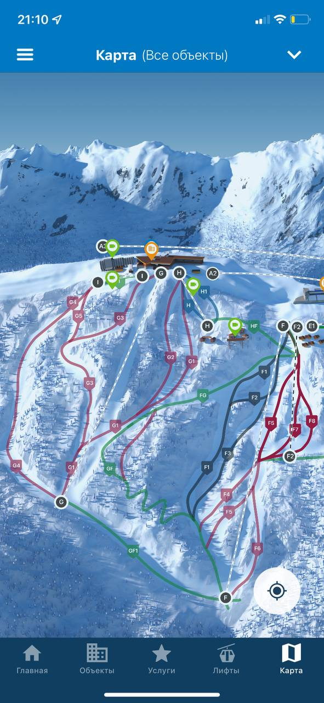
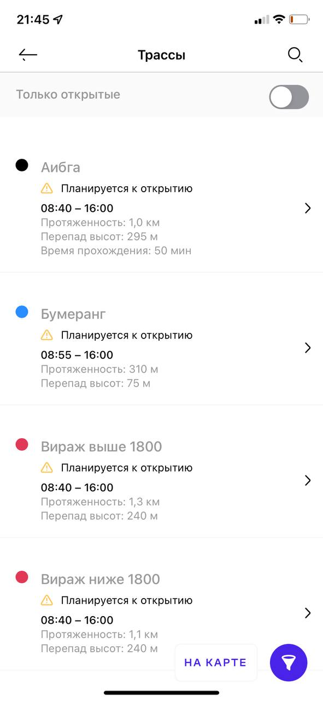
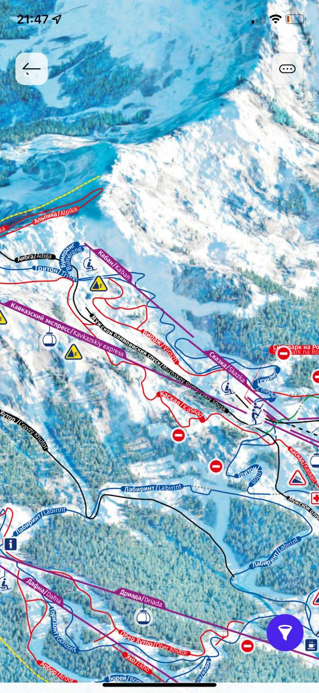
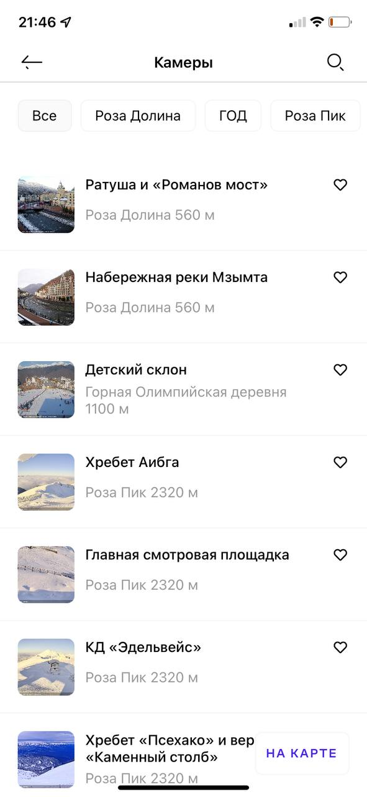
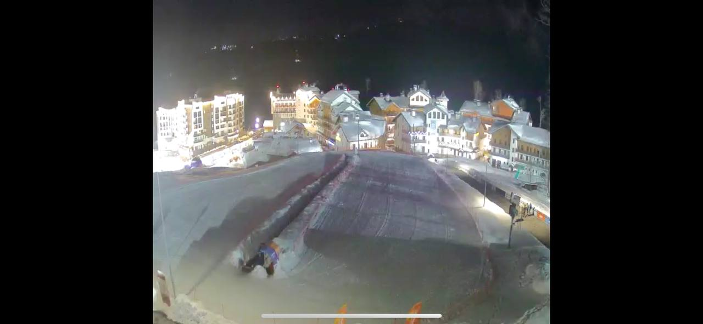
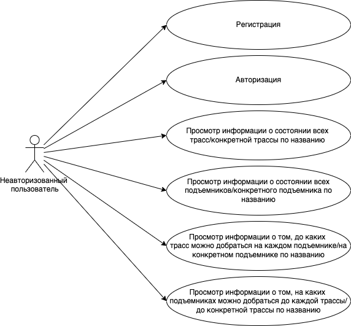
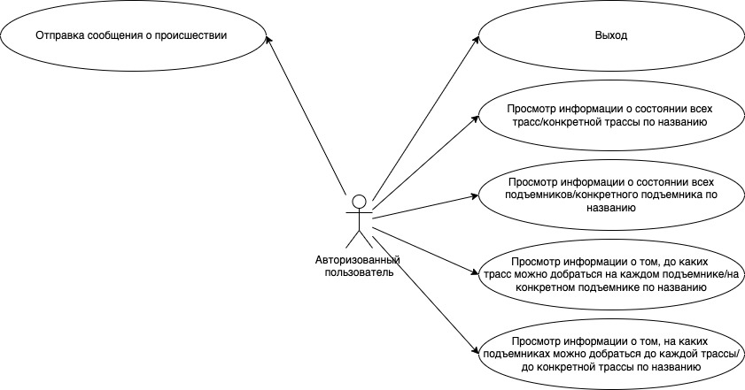
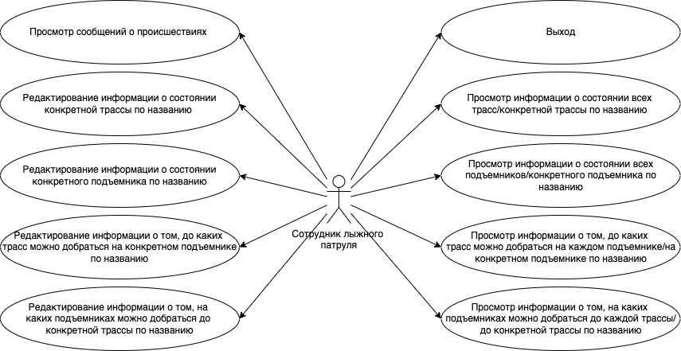
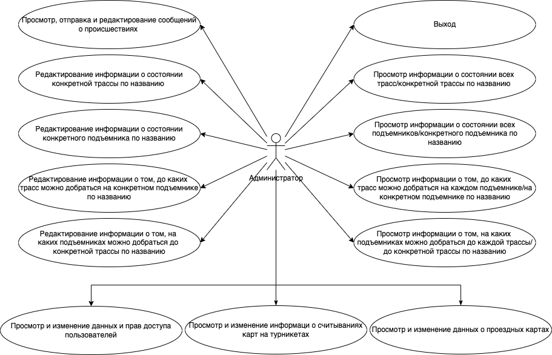

# Онлайн-мониторинг состояния объектов горнолыжного курорта

## Идея проекта

Приложение, позволяющее в онлайн-режиме получать и редактировать информацию об объектах горнолыжного курорта:

- открытость/закрытость трасс и подъемников;
- загруженность подъемников (время в очереди);
- до каких трасс можно добраться на определенном подъемнике/ на каких подъемниках можно добраться до определенной трассы;
- сообщения о неполадках на трассах/подъемниках/турникетах подъемников.

## Описание предметной области

На горнолыжных курортах интерес представляют такие объекты, как трассы, подъемники и турникеты на подъемниках. Один подъемник может вести к нескольким трассам, к одной трассе могут вести несколько подъемников. 

На каждом подъемнике стоят турникеты, для прохождения которых пользователи прикладывают специальные карты (абонименты). Имея информацию о количестве мест на подъемнике, времени его подъема и считаваниях карт на турникетах, можно в онлайн-режиме мониторить уровень загруженности данного подъемника. 

## Анализ аналогичных решений

Проведем анализ аналогичных решеий по следующим критериям:

- наличие информации об открытости/закрытости трасс и подъемников;
- наличие информации об очередях на подъемниках (очереди;
- наличие сводной информации о связях трасс и подъемников;
- возможность получить информацию о том, до каких трасс можно добраться на определенном подъемнике/на каких подъемниках можно добраться до определенной трассы.

**1. Мобильное приложение горнолыжного курорта "Газпром"**

В нем можно просмотреть информацию об открытости/закрытости трасс:

и подъемников:

а также сводную информацию о связях трасс и подъемников с помощью карты курорта:

**2. Мобильное приложение горнолыжного курорта "Courchevel"**

В нем на единой карте можно просмотреть информацию об открытости/закрытости трасс и подъемников, а также сводную информацию о связях трасс и подъемников:

**3. Мобильное приложение горнолыжного курорта "Роза Хутор"**

В нем можно просмотреть информацию об открытости/закрытости трасс:

и подъемников:

а также сводную информацию о связях трасс и подъемников с помощью карты курорта:

Также есть возможность в онлайн-режиме просматривать камеры, расположенные на различных объектах курорта. Этим можно воспользоваться для мониторинга очередей на подъемниках.

**Таблица сравнения решений по наличию в них информации**

| название приложения  | открытость/закрытость трасс и подъемников| очереди на подъемниках | сводная информация о связях трасс и подъемников  | конкретная информация о связях трасс и подъемников  |
|:----------|:----------|:----------|:----------|:----------|
| Газпром    | + (в виде списка)   | -    | + (на карте)   | -    |
| Courchevel    | + (на карте)   | -   | + (на карте)    | -    |
| Роза Хутор    | + (в виде списка)   | + (с помощью камер)   | + (на карте)   | -    |

## Обоснование целесообразности и актуальности проекта

Из таблицы сравнения видно, что ни одно из приложений не отображает всю информацию, которую предполагается предоставлять в предлагаемом приложении. В частности, наименее представлена информация об очередях на подъемниках, которая позволила бы посетителям выбирать мене загруженные объекты и тем самым делать нагрузку на них более равномерной. А предоставление информации о том, как добраться до конкретной трассы позволит упростить пользователям (в особенности, новым) орагнизацию своего катания.

## Use-Case - диаграммы.

Виды пользователей:
1. Неавторизованный пользователь
2. Авторизованный пользователь
3. Сотрудник лыжного патруля
4. Администратор

## ER-диаграмма сущностей (не путать с диаграммой БД – диаграмма сущность-связь не приземлена на конкретную СУБД и показывает сущности системы); 

## Архитектурные характеристики, важные для проекта.
