# Приложение для онлайн-мониторинга состояния объектов горнолыжного курорта.

## Запуск

Код приложения находится в папке src/SkiResort.

```
├───UI -- Компонент пользовательского интерфейса (точка входа)
│   ├───IViews
│   └───WinFormsViews
├───TechUI2 -- Альтернативный компонент пользовательского интерфейса (он же тест для UI)
│   ├───IViews
│   └───TechViews
├───AccessToDB -- Компонент доступа к данным, использующий Tarantool
│   ├───Converters
│   ├───Exceptions
│   └───TarantoolRepositories
├───AccessToDB2 -- Альтернативный компонент доступа к данным, использующий PostgreSQL
│   ├───Converters
│   ├───Models
│   └───PostgresRepositories
├───TestsAccessToDB -- Тесты для доступа к данным
├───BL -- Компонент Бизнес-логики
│   ├───Exceptions
│   ├───IRepositories
│   ├───Models
│   └───Services
├───TestsBL -- Тесты для бизнес-логики
├───Workers -- Рабочие для загрузки в БД считываний карт и периодического обновления времени в очереди
│   ├───Properties
│   └───Services
├───Experiment -- Експериментальная часть (см Report)
```


1. сгенерировать тестовые данные: 

src/tarantool/app/generate_data.py

2. Поднять контейнер: 

docker-compose -f (путь)/src/tarantool/docker-compose.yml up -d

(если нужно -- остановить)

docker-compose -f (путь)/src/tarantool/docker-compose.yml down

3. Запустить компонент src/SkiResort/UI при использовании WindowsForms или src/SkiResort/TechUI2 при использовании консоли.

Здесь же можно выбрать для использования альтернативную базу данных (компонент доступа к данным) -- PostgreSQL.


## Идея проекта

Приложение, позволяющее в онлайн-режиме получать и редактировать информацию об объектах горнолыжного курорта:

- загруженность подъемников (время в очереди);
- открытость/закрытость трасс и подъемников;
- до каких трасс можно добраться на определенном подъемнике / на каких подъемниках можно добраться до определенной трассы (в дальнейшем для краткости эта информация будет обозначаться как "связь трасс и подъемников");
- сообщения о неполадках на трассах/подъемниках/турникетах подъемников.


## Инструменты разработки

+ Язык: C#

+ Интерфейс. Два варианта на выбор: WindowsForms или консоль

+ База данных. Два варианта на выбор: Tarantool или PostgreSQL

+ Среда разработки: VisualStudio


## Use-Case - диаграммы.

Виды пользователей:
1. Неавторизованный пользователь

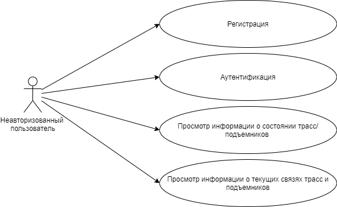

2. Авторизованный пользователь


3. Сотрудник лыжного патруля


4. Администратор

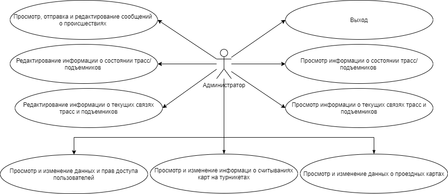


## ER-диаграмма сущностей 


Схема БД

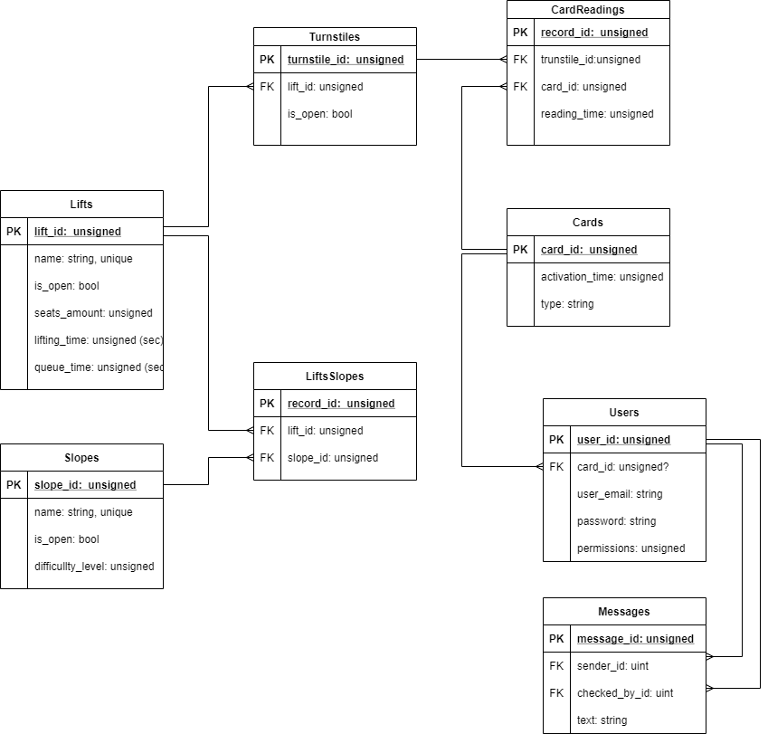


## Верхнеуровневое разбиение на компоненты 

Выделены 3 компонента: 
- компонент доступа к данным;
- компонент бизнес-логики;
- компонент реализации UI.

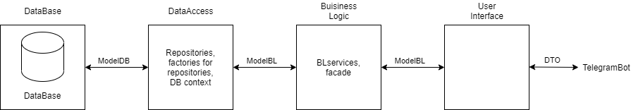


## UML диаграммы классов компонентов


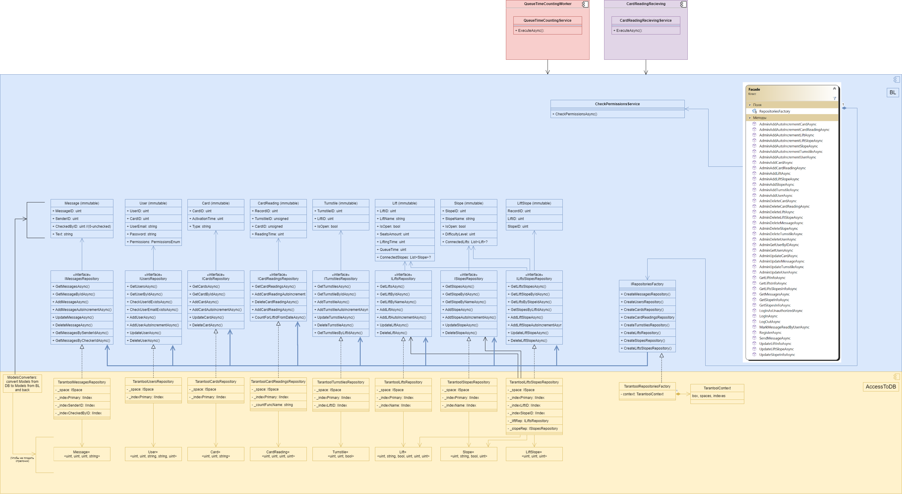


## Анализ аналогичных решений

по следующим критериям:

- наличие информации об открытости/закрытости трасс и подъемников;
- наличие информации об очередях на подъемниках (очереди);
- наличие сводной информации о связях трасс и подъемников;
- возможность получить информацию о том, до каких трасс можно добраться на определенном подъемнике/на каких подъемниках можно добраться до определенной трассы.

**1. Мобильное приложение горнолыжного курорта "Газпром"**

В нем можно просмотреть информацию об открытости/закрытости трасс:


и подъемников:

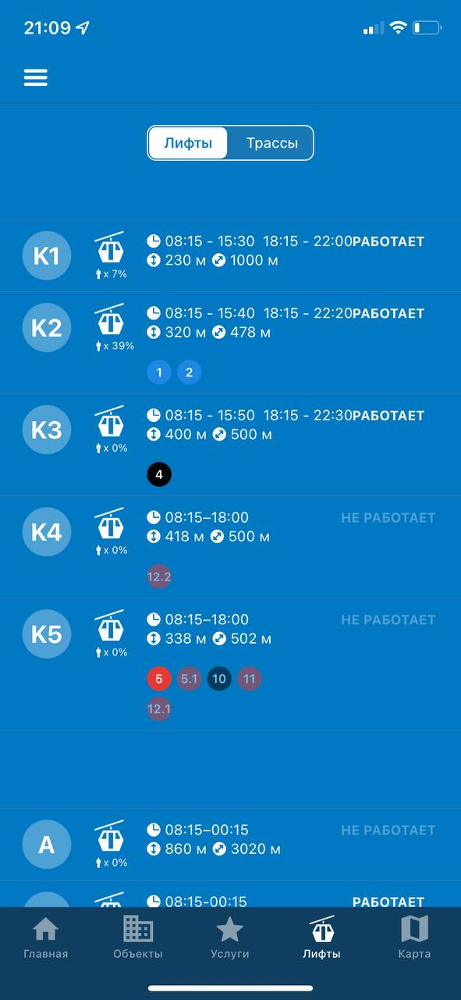


а также сводную информацию о связях трасс и подъемников с помощью карты курорта:

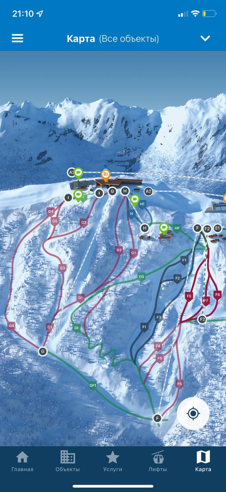


**2. Мобильное приложение горнолыжного курорта "Courchevel"**

В нем на единой карте можно просмотреть информацию об открытости/закрытости трасс и подъемников, а также сводную информацию о связях трасс и подъемников:


**3. Мобильное приложение горнолыжного курорта "Роза Хутор"**

В нем можно просмотреть информацию об открытости/закрытости трасс:

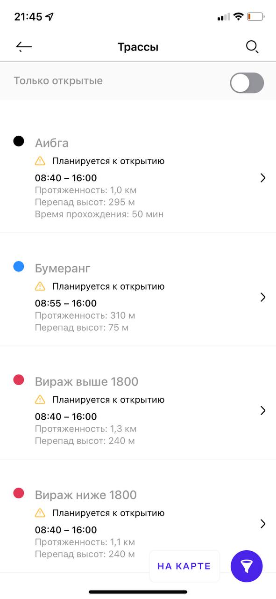

и подъемников:


а также сводную информацию о связях трасс и подъемников с помощью карты курорта:

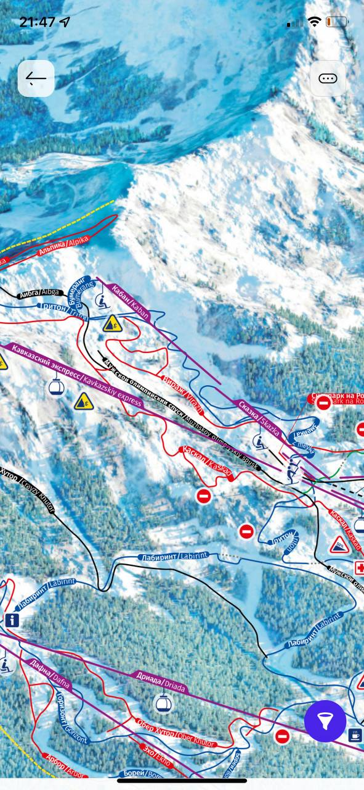

Также есть возможность в онлайн-режиме просматривать камеры, расположенные на различных объектах курорта. Этим можно воспользоваться для мониторинга очередей на подъемниках.

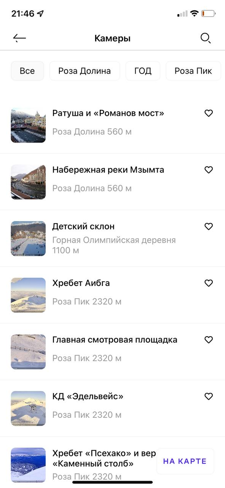
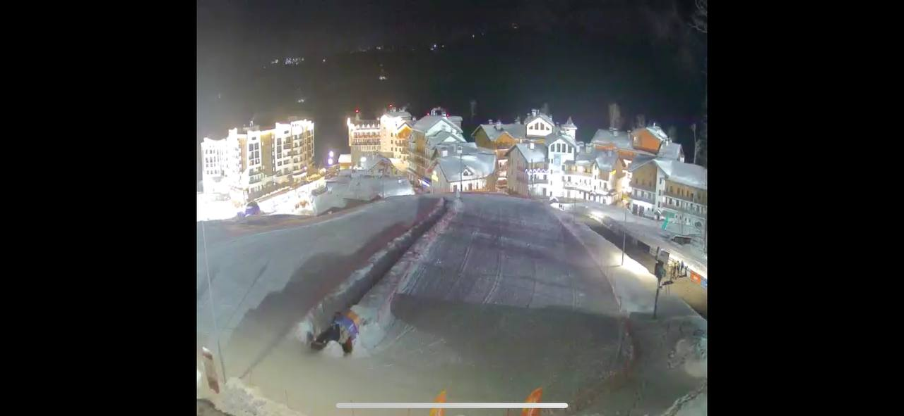


**Таблица сравнения решений по наличию в них информации**

| название приложения  | открытость/закрытость трасс и подъемников| очереди на подъемниках | сводная информация о связях трасс и подъемников  | конкретная информация о связях трасс и подъемников  |
|:----------|:----------|:----------|:----------|:----------|
| Газпром    | + (в виде списка)   | -    | + (на карте)   | -    |
| Courchevel    | + (на карте)   | -   | + (на карте)    | -    |
| Роза Хутор    | + (в виде списка)   | + (с помощью камер)   | + (на карте)   | -    |

Из таблицы сравнения видно, что ни одно из приложений не отображает всю информацию, которую предполагается предоставлять в предлагаемом приложении. В частности, наименее представлена информация об очередях на подъемниках, которая позволила бы посетителям выбирать мене загруженные объекты и тем самым делать нагрузку на них более равномерной. А предоставление информации о том, как добраться до конкретной трассы позволит упростить пользователям (в особенности, новым) орагнизацию своего катания.


