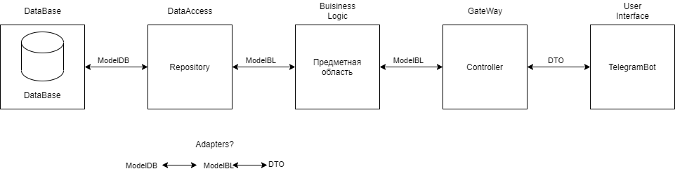
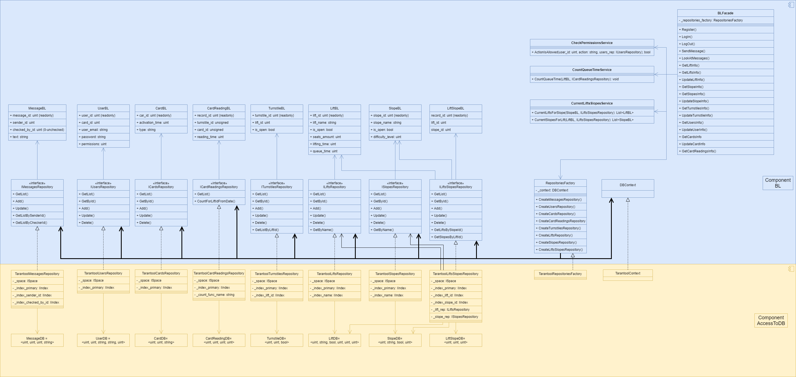

# Онлайн-мониторинг состояния объектов горнолыжного курорта
# Лабораторная работа 2

## 1. Описание типа приложения и выбранного технологического стека 

Интерфейс представляет собой telegram-бота (https://github.com/MrRoundRobin/telegram.bot)

База данных - tarantool (https://github.com/progaudi/progaudi.tarantool)

Язык - C#. 

Среда разработки - VisualStudio.

## 2. Верхнеуровневое разбиение на компоненты 

Выделены 3 компонента: 
- компонент доступа к данным;
- компонент бизнес-логики;
- компонент реализации UI.

## 3. UML диаграммы классов компонентов доступа к данным и бизнес-логики (модельных и компонент)

